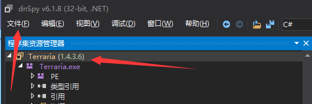
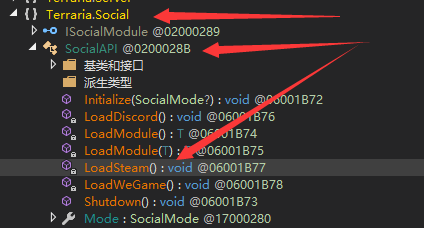

# Terraria AUTO-FISH tutorial
FOR [ENGLISH VERSION](https://github.com/CurssedCoffin/Treearia-auto-fish/blob/main/README_EN.MD)

**教程中所用代码和思路来自于[吾爱论坛](https://www.52pojie.cn/thread-1425351-1-1.html)，本人负责提供一个清晰明确的过程**

**该方法具有以下两个缺点：1、钓鱼时，Terraria需处于前台，无法在后台进行钓鱼（实现方法为调用Windows的鼠标点击操作实现收放鱼竿） 2、游戏无法完全关闭（虽然窗口已经关闭，但进程任然存在，需要手动到任务管理器中关闭，原因为钓鱼过程中使用了一个线程，并且线程未结束，目前没有找到这个bug的一个好的修复方法）**

**在Terraria 1.4.3.6版本下测试可行**


## 使用工具：[dnSpy](https://github.com/dnSpy/dnSpy)
请下载使用**32**位版本

## 自动钓鱼实现
* 使用dnSpy打开terraria主程序，进行反编译
* 在程序左侧找到Terraria - Terraria.exe - Terraria - Projectile
* 右键点击Projectile，选择创建字段，如图中红框所示


* 在弹出的窗口中更改名称为```fishFlag```， 并勾选**static**；在类型栏目中将默认类型```int```改为```bool``` ，具体方法为：点击清除，点击类型，在新弹出的窗口中搜索```bool```，并添加如图中所示bool类型（注意```bool```类型由```{}System```提供），点击确定即可完成创建


* 同上一步，添加名称为```createdThread```的字段
* 右键点击Projectile，选择创建方法，名称为```mouse_event```，并勾选**static**；在签名栏目中添加输入参数类型，具体方法为：点击类型按钮，在新的弹出窗口中搜索```System.int```（注意```int```类型由```{}System```提供），点击确定，再点击添加。重复这个添加过程五次，用以添加5个int类型参数


* 在程序左侧找到Terraria - Terraria.exe - Terraria - Projectile - mouse_event(字体显示颜色为橙色)，右键点击```mouse_event```，选择```编辑方法（C#）```，在右侧代码区域内，在顶部声明部分添加```using System.Runtime.InteropServices;```，并将图中红框部分用如下代码替换


```
[DllImport("user32")]
private static extern void mouse_event(int dwFlags, int dx, int dy, int dwData, int dwExtraInfo);
```
* 结束之后点击窗口右下角的编译按钮，完成对```mouse_event```方法的创建
* 右键点击Projectile，选择创建方法，名称为```DoFish```，点击确定即可


* 在程序左侧找到Terraria - Terraria.exe - Terraria - Projectile - DoFish(字体显示颜色为橙色)，右键点击```DoFish```，选择```编辑方法（C#）```，在右侧代码区域内，在顶部声明部分添加```using System.Threading;``` ，并将图中红框部分用如下代码替换


```
public void DoFish()
{
	int millisecondsTimeout = 1200;
	for (;;)
	{
		if (Projectile.fishFlag)
		{
			Projectile.mouse_event(2, 0, 0, 0, 0);
			Thread.Sleep(100);
			Projectile.mouse_event(4, 0, 0, 0, 0);
			Thread.Sleep(millisecondsTimeout);
			Projectile.mouse_event(2, 0, 0, 0, 0);
			Thread.Sleep(100);
			Projectile.mouse_event(4, 0, 0, 0, 0);
			Thread.Sleep(100);
			Projectile.fishFlag = false;
		}
	}
}
```
* 结束之后点击窗口右下角的编译按钮，完成对```DoFish```方法的创建
* 在程序左侧找到Terraria - Terraria.exe - Terraria - Projectile - FishingCheck(字体显示颜色为橙色)，右键点击```FishingCheck```，选择```编辑方法（C#）```，在右侧代码区域内，在顶部声明部分添加```using System.Threading;``` ，并在**末尾**处，if函数下面（图中箭头指向部分）添加如下代码：


```
if (this.bobber && this.Name == "浮标")
{
	if (!Projectile.createdThread)
	{
		Thread thread = new Thread(new ThreadStart(this.DoFish));
		Projectile.createdThread = true;
		thread.Start();
	}
	Projectile.fishFlag = true;
}
```
* 结束之后点击窗口右下角的编译按钮，完成对```FishingCheck```方法的修改
* 在程序左侧找到Terraria，左键点击，然后点击程序左上角的文件，保存模块，选择路径，确定




* 如此，便可以成功反编译并保存到exe文件中，运行保存的exe，在游戏中钓鱼查看效果

## 离线游玩实现（免steam）
* 通过注释初始化steam信息的代码，可以实现免登录
* 在程序左侧找到Terraria - Terraria.exe - Terraria.Social - SocialAPI - LoadSteam(字体显示颜色为橙色)，右键点击```LoadSteam```，选择```编辑方法（C#）```，在右侧代码区域内，将图中红框部分删除即可




* steam正版的存档位置在
```C:\Program Files (x86)\Steam\userdata\[your steam id]\105600\remote```，该路径会随着你的steam安装位置和你的steamid不同而改变
* 离线版的存档位置在```%userprofile%\Documents\My Games\Terraria```路径下

* 一些别的细节
```
Terraria - Terraria.exe - Terraria - Item - SetDefaults //初始化物品属性，可以在这里改单独武器的伤害，效率
Terraria - Terraria.exe - Terraria.GameContent.ItemDropRules - ItemDropDatabase //掉落的物品和概率，概率值为%0.1的倍数，20代表概率为2%
```
```
Terraria - Terraria.exe - Terraria - Item - buyPrice //购买价格
Terraria - Terraria.exe - Terraria - Item - sellPrice //出售价格
Terraria - Terraria.exe - Terraria - Player - Hurt //受到伤害，经过测试可能和无敌帧有一点关系但不多，数值也不影响受到伤害，直接return一个数就可以无敌，烧伤等负面效果无法免疫
Terraria - Terraria.exe - Terraria - Player - GetWeaponDamage //所有武器伤害的计算都在这里
```
编译时报错```the type or namespace name "ReLogic"```，则去```Terraria - Terraria.exe - 资源```里看看有没有类似的dll，导出dll到相同目录下即可。
