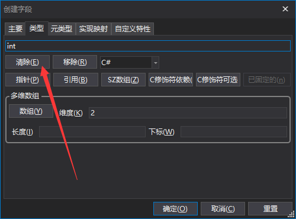
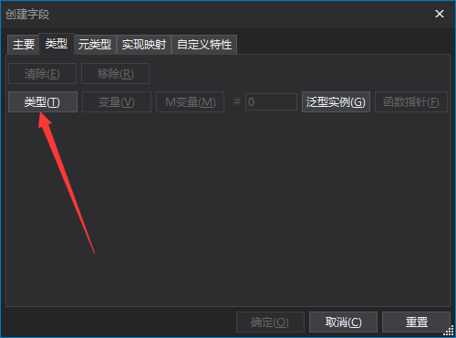
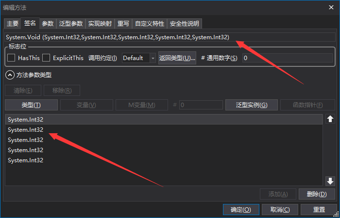
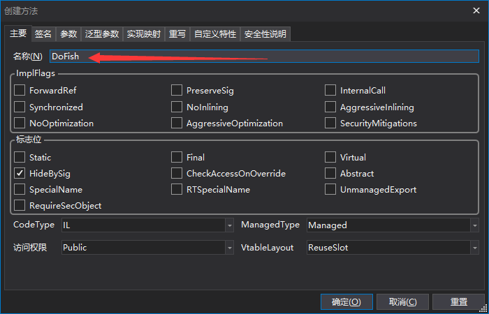
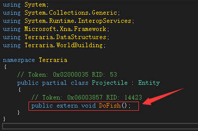
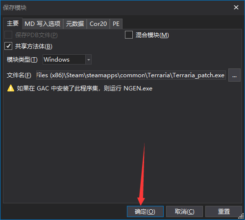

# Terraria AUTO-FISH tutorial
** The code and ideas used in the tutorial are from [吾爱论坛](https://www.52pojie.cn/thread-1425351-1-1.html), I am responsible for providing a clear and explicit process **

** This method has the following two disadvantages: 1, fishing, Terraria should be at the front desk, not in the background of fishing (implementation method for invoking Windows down rod) of the mouse to click operation implementation of 2, games can't completely shut down (though the window has been closed, but the process still exist, the need to manually shut down in the task manager, the reason for using a thread in the process of fishing, No good fix has been found for this bug.) **

** This works with Terraria 1.4.3.6 **


## [dnSpy](https://github.com/dnSpy/dnSpy)
Please download the bit version using **32**

## Automatic fishing implementation
* Open the main Terraria program with dnSpy and decomcompile it
* On the left side of the program find Terraria-Terraria.exe-Terraria-Peojectile
* Right click on Peojectile and select Create Field, as shown in the red box


* In the window that is displayed, change the name to ```fishFlag``` and select **static**. Change the default type ```int``` to ```bool``` in the type column as follows: Click Clear, click Type, search for < GT R ="18"/> in the new pop-up window, and add the bool type as shown in the figure (note that < GT r="19"/> type is provided by < GT r="20"/>), click OK to complete the creation







* As in the previous step, add a field named ```createdThread```
* Right click on Peojectile, select Create method, name it < GT R ="28"/>, and check < GT R ="32"/>; Add the input parameter type in the signature column by clicking the type button, searching for < GT r="29"/> in the new pop-up window (note that < GT r="30"/> type is provided by < GT r="31"/>), click OK, and then click Add. Repeat this process five times to add five int parameters





* On the left side of the program go to Terraria-Terraria.exe-Terraria-Peojectile-Mouse_Event (font color is orange), right click < GT R ="37"/>, select < GT R ="38"/>, In the right code area, add ```using System.Runtime.InteropServices;``` to the top declaration and replace the red box with the following code


```
[DllImport("user32")]
private static extern void mouse_event(int dwFlags, int dx, int dy, int dwData, int dwExtraInfo);
```
* When finished, click the compile button in the lower right corner of the window to complete the creation of the ```mouse_event``` method
* Right click on Peojectile, select Create method, name it , and click OK



* On the left side of the program go to Terraria-Terraria.exe-Terraria-Peojectile-dofish (font color is orange), right click < GT R ="44"/>, select < GT R ="45"/>, in the right side of the code area, Add ```using System.Threading;``` to the top declaration and replace the red box with the following code




```
public void DoFish()
{
	int millisecondsTimeout = 1200;
	for (;;)
	{
		if (Projectile.fishFlag)
		{
			Projectile.mouse_event(2, 0, 0, 0, 0);
			Thread.Sleep(100);
			Projectile.mouse_event(4, 0, 0, 0, 0);
			Thread.Sleep(millisecondsTimeout);
			Projectile.mouse_event(2, 0, 0, 0, 0);
			Thread.Sleep(100);
			Projectile.mouse_event(4, 0, 0, 0, 0);
			Thread.Sleep(100);
			Projectile.fishFlag = false;
		}
	}
}
```
* When finished, click the compile button in the lower right corner of the window to complete the creation of the ```DoFish``` method
* On the left side of the program go to Terraria-Terraria.exe-Terraria-Peojectile-FishingCheck (font color is orange), right click < GT R ="49"/>, select < GT R ="50"/>, In the code area on the right, add ```using System.Threading;``` to the top declaration section, and at **末尾**, under the if function (where the arrow points) add the following code:


```
if (this.bobber && this.Name == "浮标")
{
	if (!Projectile.createdThread)
	{
		Thread thread = new Thread(new ThreadStart(this.DoFish));
		Projectile.createdThread = true;
		thread.Start();
	}
	Projectile.fishFlag = true;
}
```
* When finished, click the compile button in the lower right corner of the window to complete the modification of the ```FishingCheck``` method
* Find Terraria on the left side of the program, left click, then click File in the top left corner of the program, Save the module, select Path, and OK




* In this way, you can successfully decompile and save to the EXE file, run the saved EXE, fishing in the game to see the effect

## Offline Play implementation (Steam free)
* By commenting the code that initializes Steam information, you can do so without logging in
* On the left side of the program go to Terraria-Terraria.exe-terraria.social-socialapi-loadsteam (font color is orange), right click , select < GT R ="59"/>, In the code area on the right, delete the red box in the figure


* The Steam genuine archive is located at
```C:\Program Files (x86)\Steam\userdata\[your steam id]\105600\remote```, which changes depending on where your Steam is installed and where your Steamid is
* The offline version is stored in the ```%userprofile%\Documents\My Games\Terraria``` path