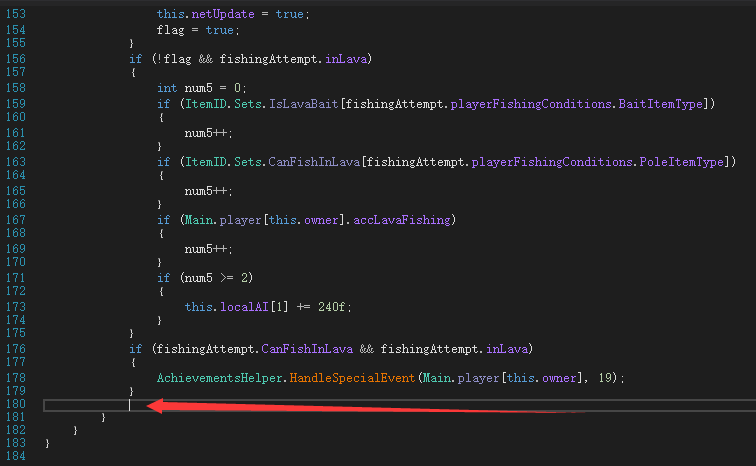
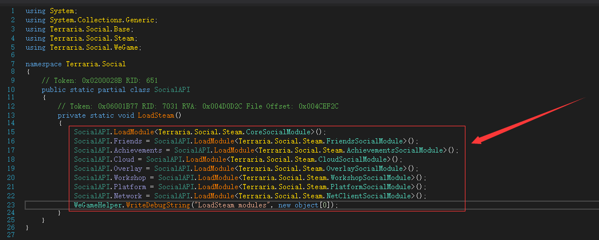

# Terraria AUTO-FISH tutorial
**The code and ideas used in the tutorial are from [吾爱论坛](https://www.52pojie.cn/thread-1425351-1-1.html), I am responsible for providing a clear and explicit process**

**This method has the following two disadvantages: 1, fishing, Terraria should be at the front desk, not in the background (Invoke the mouse click operation of Windows to realize the retraction and release of the fishing rod) 2, games can't completely shut down (though the window has been closed, but the process still exist, need to manually shut down in the task manager, the reason is a thread in the process of fishing, No good fix has been found for this bug.)**

**This works with Terraria 1.4.3.6**


## Tool using [dnSpy](https://github.com/dnSpy/dnSpy)
Please download the **32** bit version

## Automatic fishing implementation
* Open the main Terraria program with dnSpy and decomcompile it
* On the left side of the program find Terraria - Terraria.exe - Terraria - Projectile
* Right click on Projectile and select Create Field, as shown in the red box


* In the window that is displayed, change the name to ```fishFlag``` and select **static**. Change the default type ```int``` to ```bool``` in the type column as follows: Click Clear, click Type, search for ```bool``` in the new pop-up window, and add the bool type as shown in the figure (note that ```bool``` type is provided by ```{}System```), click OK to complete the creation


* As in the previous step, add a field named ```createdThread```
* Right click on Projectile, select Create method, name it ```mouse_event```,  and select **static**; Add the input parameter type in the signature column by clicking the type button, searching for ```System.int``` in the new pop-up window (note that ```int``` type is provided by ```{}System```), click OK, and then click Add. Repeat this process five times to add five int parameters


* On the left side of the program go to Terraria - Terraria.exe - Terraria - Projectile - mouse_event (font color is orange), right click < GT R ="37"/>, select ```mouse_event```, In the right code area, add ```using System.Runtime.InteropServices;``` to the top declaration and replace the red box with the following code


```
[DllImport("user32")]
private static extern void mouse_event(int dwFlags, int dx, int dy, int dwData, int dwExtraInfo);
```
* When finished, click the compile button in the lower right corner of the window to complete the creation of the ```mouse_event``` method
* Right click on Projectile, select Create method, name it ```DoFish```, and click OK


* On the left side of the program go to Terraria - Terraria.exe - Terraria - Projectile - DoFish (font color is orange), right click ```DoFish```, select ```Edit Method (C#)```, in the right side of the code area, Add ```using System.Threading;``` to the top declaration and replace the red box with the following code


```
public void DoFish()
{
	int millisecondsTimeout = 1200;
	for (;;)
	{
		if (Projectile.fishFlag)
		{
			Projectile.mouse_event(2, 0, 0, 0, 0);
			Thread.Sleep(100);
			Projectile.mouse_event(4, 0, 0, 0, 0);
			Thread.Sleep(millisecondsTimeout);
			Projectile.mouse_event(2, 0, 0, 0, 0);
			Thread.Sleep(100);
			Projectile.mouse_event(4, 0, 0, 0, 0);
			Thread.Sleep(100);
			Projectile.fishFlag = false;
		}
	}
}
```
* When finished, click the compile button in the lower right corner of the window to complete the creation of the ```DoFish``` method
* On the left side of the program go to Terraria - Terraria.exe - Terraria - Projectile - FishingCheck (font color is orange), right click ```FishingCheck```, select ```Edit Method (C#)```, In the code area on the right, add ```using System.Threading;``` to the top declaration section, and at **end**, under the if function (where the arrow points) add the following code:




```
if (this.bobber && this.Name == "浮标")
{
	if (!Projectile.createdThread)
	{
		Thread thread = new Thread(new ThreadStart(this.DoFish));
		Projectile.createdThread = true;
		thread.Start();
	}
	Projectile.fishFlag = true;
}
```
* When finished, click the compile button in the lower right corner of the window to complete the modification of the ```FishingCheck``` method
* Find Terraria on the left side of the program, left click, then click File in the top left corner of the program, Save the module, select Path, and OK


* In this way, you can successfully decompile and save to the EXE file, run the saved EXE, fishing in the game to see the effect

## Offline Play implementation (with no Steam)
* By commenting the code that initializes Steam information, you can do so without logging in
* On the left side of the program go to Terraria - Terraria.exe - Terraria.Social - SocialAPI - LoadSteam (font color is orange), right click ```LoadSteam```, select ```Edit Method (C#)```, In the code area on the right, delete the red box in the figure




* The Steam online save is located at
```C:\Program Files (x86)\Steam\userdata\[your steam id]\105600\remote```, which changes depending on where your Steam is installed and what your Steamid is
* The offline save is stored in the ```%userprofile%\Documents\My Games\Terraria``` path
* some other details
````
Terraria - Terraria.exe - Terraria - Item - buyPrice //buy price
Terraria - Terraria.exe - Terraria - Item - sellPrice //Sell Price
Terraria - Terraria.exe - Terraria - Item - SetDefaults //Initialize item properties, you can change the damage of individual weapons here
Terraria - Terraria.exe - Terraria - Player - Hurt //Inflicted damage. After testing, it may be related to the invincibility frame, but not much. The value does not affect the damage. If you return a number directly, you will be invincible. Negative effects such as burns cannot be immune.
Terraria - Terraria.exe - Terraria - Player - GetWeaponDamage // all weapon damage calculations are here
````
If an error occurs when compiling ```the type or namespace name "ReLogic"```, go to ```Terraria - Terraria.exe - Resources``` to see if there is a similar dll, and export the dll to the same directory. .
